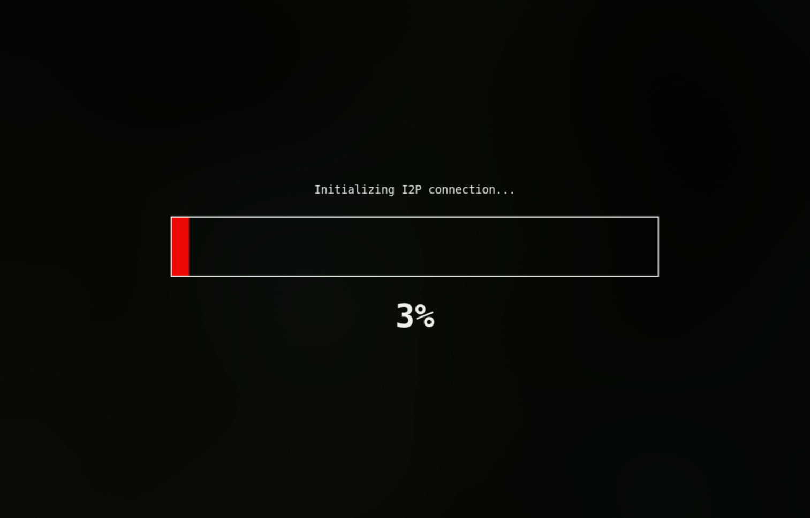
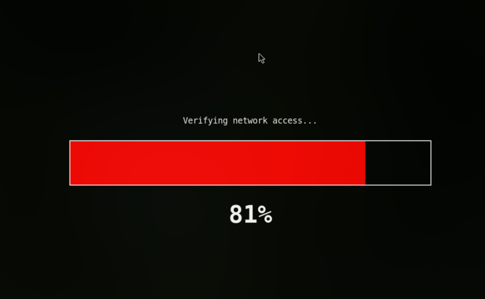
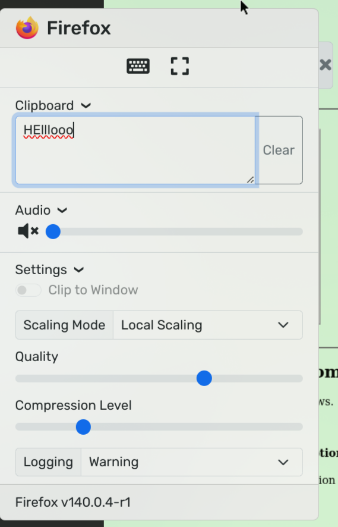
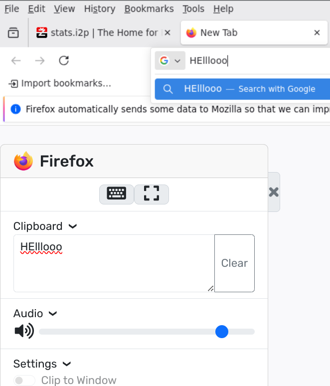

# Dockerized I2P Privacy Browser

[](https://shields.io/)
[](https://www.docker.com/)
[](https://geti2p.net/)

A self-contained, Dockerized environment for browsing I2P sites securely. It bundles a pre-configured Firefox with an `i2pd` router and provides access through a web-based GUI (NoVNC) using [jlesage/docker-baseimage-gui](https://github.com/jlesage/docker-baseimage-gui)

  
  
  
  

## Features

-   **User-Friendly Loading Screen:** A smooth, animated progress bar shows the I2P connection status, only launching Firefox when the network is fully ready (i2p beginner ready).
-   **Audio Support:** Audio from Firefox is streamed through the browser using sockets.
-   **Clipboard Support:** Clipboard from host to noVNC working
-   **Resolution/Compression/Scaling Control:** Adjust your settings for slow networks if using remote hosts
-   **Lightweight:** Built on a minimal Alpine Linux base.
-   **Pre-configured Firefox:** Ready to browse `.i2p` sites out-of-the-box.
-   **Integrated `i2pd` Router:** Manages the connection to the I2P network automatically.
-   **Web-Based GUI:** Access the browser from any modern device on your network via NoVNC.
-   **Flexible Persistence:** Run in a fully ephemeral mode for maximum privacy, or mount specific volumes to save your I2P bootstrap data, Firefox profile, or downloads across sessions.

## Run From DockerHub
you can use built container from DockerHub or build your own in next section  
```bash
docker run --rm -it -p 5800:5800 tqwee/i2pd-firefox:latest
```
**Access the GUI:** Open your web browser and navigate to: **`http://localhost:5800`**

## Quick Start

1.  **Clone and Build the Docker Image:**
    ```bash
    git clone https://github.com/Justxd22/i2p_browser && cd i2p_browser
    docker build -t i2pd-firefox .
    ```

2.  **Run the Container (Ephemeral Mode):**
    This is the recommended mode for maximum privacy. All data will be erased when the container is stopped.
    ```bash
    docker run --rm -it -p 5800:5800 i2pd-firefox
    ```

3.  **Access the GUI:**
    Open your web browser and navigate to:
    **`http://localhost:5800`**

## How It Works

On startup, the container performs the following sequence:
1.  The `i2pd` service is started in the background to begin connecting to the I2P network.
2.  A full-screen Python GUI is displayed, showing a loading progress bar.
3.  The GUI monitors the `i2pd` service, waiting for two conditions:
    - The I2P tunnel creation success rate is stable.
    - An I2P test URL is accessible through the local proxy.
4.  Once both conditions are met, the loading screen closes, and the main Firefox browser is launched to `stats.i2p`, ready for use.

## Configuration: Data Persistence

By default, the container is ephemeral. To save data, you can mount specific host directories as volumes into the container.

### **Save Nothing Max Privacy** Enabled by default

```bash
docker run -it --rm -p 5800:5800 i2pd-firefox
```

### **Fully Persistent**
Mount a single host directory to `/config`. Everything (I2P data, profile, downloads) will be saved.

```bash
docker run -it --rm -p 5800:5800 -v $(pwd)/my-firefox-data:/config:rw i2pd-firefox
```

### **Only save your Firefox profile and downloads**, but get a fresh I2P identity every time:

```bash
docker run -it --rm -p 5800:5800 \
    -v $(pwd)/my-firefox-profile:/config/profile:rw \
    -v $(pwd)/my-firefox-downloads:/config/downloads:rw \
    i2pd-firefox
```

### **Only save the I2P bootstrap data** for fast network connection, but use a fresh Firefox profile every time:

```bash
docker run -it --rm -p 5800:5800 \
    -v $(pwd)/my-i2pd-data:/config/i2pd:rw \
    i2pd-firefox
```


## Support the project

- xmr: `433CbZXrdTBQzESkZReqQp1TKmj7MfUBXbc8FkG1jpVTBFxY9MCk1RXPWSG6CnCbqW7eiMTEGFgbHXj3rx3PxZadPgFD3DX`
- xmr: `4ACPJKijtYsBn1vsYdjS6sLavgvvyEVYg54adcHGYepUMFi8sUttk9obNfaRv3TCMZN5pMeHLiTTpHjAdTkLYPDr33BBRh5`
- birdpay: `@_xd222`
